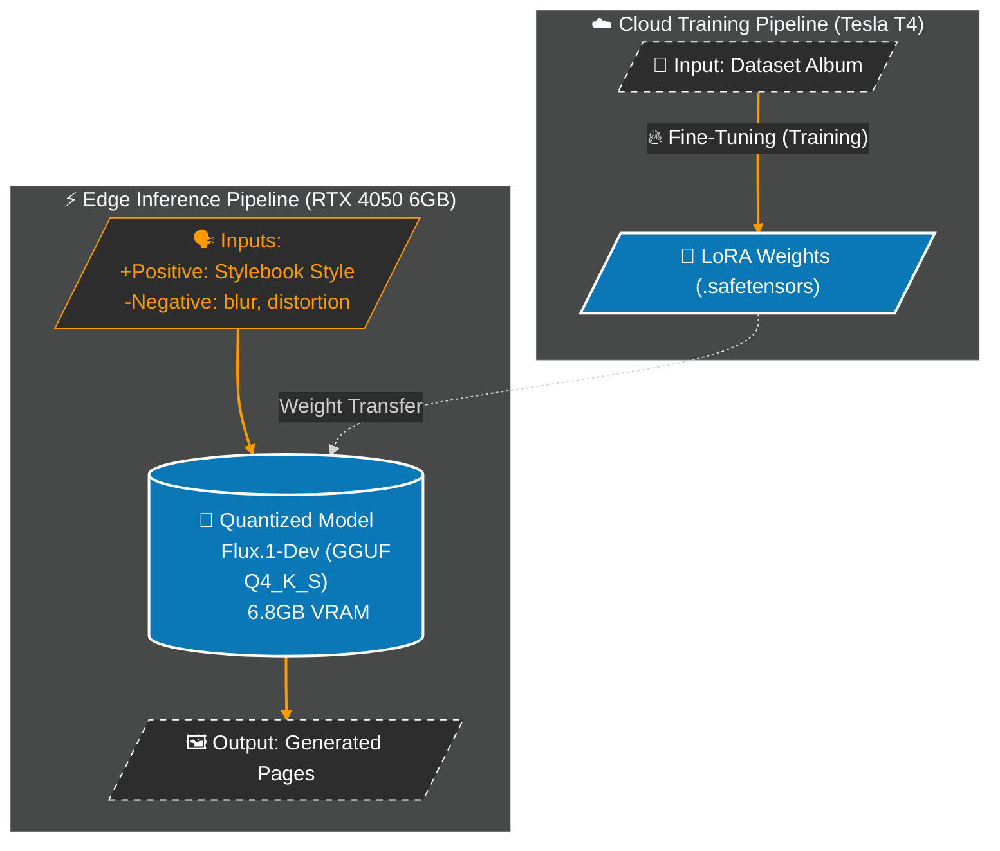

# Project Vulcan: Hybrid Cloud-Edge Digital Twin Orchestrator

### 🔬 Project Overview
Project Vulcan enables the deployment of the 12B-parameter Flux.1 model on consumer hardware with limited VRAM. By architecting a hybrid pipeline, this project successfully bypasses the hardware constraints of the NVIDIA RTX 4050 (6GB) to run a model that typically requires over 24GB of VRAM. 
### 🏗️ Technical Architecture & Visual Pipeline




### 🏗️ Technical Architecture
The system is built on three core pillars of optimization:
1.  **Decoupled Learning (Cloud):** Fine-tuned identity-specific weights (**LoRA**) on Kaggle using Tesla T4 GPUs to handle the high-memory requirements (40GB+) of the training phase.
2.  **VRAM Resource Optimization (Edge):** Strategically integrated **4-bit GGUF (Q4_K_S) quantization**, reducing the model's memory footprint from **23.8GB to 6.8GB**—a **71.4% reduction**. This specific bit-depth was selected to maximize the remaining VRAM for the DualCLIPLoader and VAE decode process.
3.  **Cross-OS Orchestration Bridge:** A Python-based **WebSocket bridge** (WSL2-to-Windows) that allows for a Linux-native development workflow while accessing bare-metal GPU performance on the host Windows OS.


### 📊 Performance Benchmarks
| Metric | Baseline (FP16) | Optimized (GGUF Q4) | Change |
| :--- | :--- | :--- | :--- |
| **Model Size** | 23.8 GB | 6.8 GB | **-71.4%** |
| **VRAM Required** | >24 GB | <6 GB | **Hardware Viable** |
| **Training VRAM** | >40 GB | 16 GB (Cloud) | **Cost Optimized** |

### 🛠️ Tech Stack
* **Model:** Flux.1-Dev (12B Parameters)
* **Optimization Strategy:** GGUF 4-bit Quantization (Integrated)
* **Fine-Tuning:** LoRA (Low-Rank Adaptation)
* **Infrastructure:** WSL2 (Mirrored Mode), ComfyUI API, WebSocket Client

### 📦 Setup & Asset Management
Due to repository hygiene and file size limitations, large binary weights are excluded from Git. 

#### 1. Host Asset Placement (Windows)
Ensure the following files are present in your ComfyUI directory:
* `models/unet/flux1-dev-Q4_K_S.gguf`
* `models/loras/caitlyn_lifestyle_v1.safetensors`

#### 2. Linux Orchestration (WSL2)
```bash
# Enable Mirrored Networking in .wslconfig for localhost access
# Install dependencies
pip install -r requirements.txt
# Run the Director
python core/director.py
